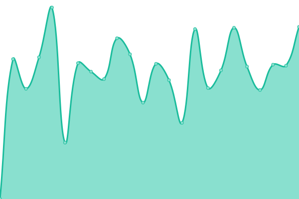

# Upptime Tracker

_Why use Upptime and not host your own uptime tracker ?_

If you want to have an uptime tracker for your sites hosted on a vps, you would theoretically need the tracker to be on a different server for it to be able to send a failure update. Instead of paying for an extra server to host an uptime tracker to track the wanted server, Upptime allows for uptime checks using:

Github Actions to deploy the uptime test following a schedule

Github Issues to notify if a website is unreachable

Github Pages to display your upptime dashboard

- Start a new template repo from upptime/upptime (include all branches, set to public for unlimited minutes)
- in developer settings, generate new fine grained token for created repo
- Set actions,contents,issues and workflows access to read&write
- Copy token to created repo secrets and variables in actions 'GH_PAT'
- edit .upptimerc.yml as needed for your needs (modify owner, repo, sites,baseurl, remove cname line)

This repository contains the open-source uptime monitor and status page for [Daniel Jerusalmy](https://Darkamui.github.io/upptime-tracker), powered by [Upptime](https://github.com/upptime/upptime).

With [Upptime](https://upptime.js.org), you can get your own unlimited and free uptime monitor and status page, powered entirely by a GitHub repository. We use [Issues](https://github.com/Darkamui/upptime-tracker/issues) as incident reports, [Actions](https://github.com/Darkamui/upptime-tracker/actions) as uptime monitors, and [Pages](https://Darkamui.github.io/upptime-tracker) for the status page.

<!--start: status pages-->
<!-- This summary is generated by Upptime (https://github.com/upptime/upptime) -->
<!-- Do not edit this manually, your changes will be overwritten -->
<!-- prettier-ignore -->
| URL | Status | History | Response Time | Uptime |
| --- | ------ | ------- | ------------- | ------ |
|  [J-web](https://www.j-web.ca) | 🟩 Up | [j-web.yml](https://github.com/Darkamui/upptime-tracker/commits/HEAD/history/j-web.yml) | 

 295ms
     
 | 

<a href="https://Darkamui.github.io/upptime-tracker/history/j-web">100.00%</a>
    

|  [Raphael Jerusalmy](https://raphaeljerusalmy.com) | 🟩 Up | [raphael-jerusalmy.yml](https://github.com/Darkamui/upptime-tracker/commits/HEAD/history/raphael-jerusalmy.yml) | 

 502ms
     
 | 

<a href="https://Darkamui.github.io/upptime-tracker/history/raphael-jerusalmy">100.00%</a>
    

|  [Manuel Bleu](https://manuelbleu.com) | 🟩 Up | [manuel-bleu.yml](https://github.com/Darkamui/upptime-tracker/commits/HEAD/history/manuel-bleu.yml) | 

 880ms
     
 | 

<a href="https://Darkamui.github.io/upptime-tracker/history/manuel-bleu">100.00%</a>
    

<!--end: status pages-->

[**Visit our status website →**](https://Darkamui.github.io/upptime-tracker)

## 📄 License

- Powered by: [Upptime](https://github.com/upptime/upptime)
- Code: [MIT](./LICENSE) © [Anand Chowdhary](https://anandchowdhary.com), supported by [Pabio](https://pabio.com)
- Data in the `./history` directory: [Open Database License](https://opendatacommons.org/licenses/odbl/1-0/)
